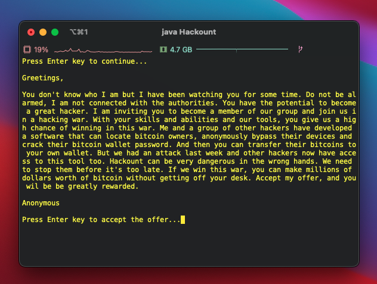
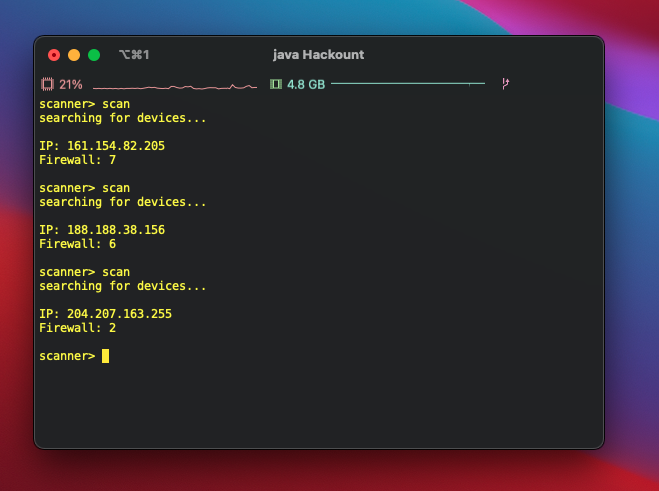

# hackount

If you don't already have java, download it with this link
https://www.java.com/en/download/
or
https://www.oracle.com/java/technologies/javase-jdk14-downloads.html

Windows users can use the Batch file for easier run. I'll figure something out for Mac users later.

For the best experience, make sure your terminal, or Command Prompt's background color is set to black.

## Game Demo

### Starting the game

  

### Your system

### Scanning and bypassing

  

### The victim's system

### Downloading upgrades from the victim's system

### Cracking the victim's bitcoin wallet

### Transferring the bitcoins to your own wallet

### Buying upgrades

